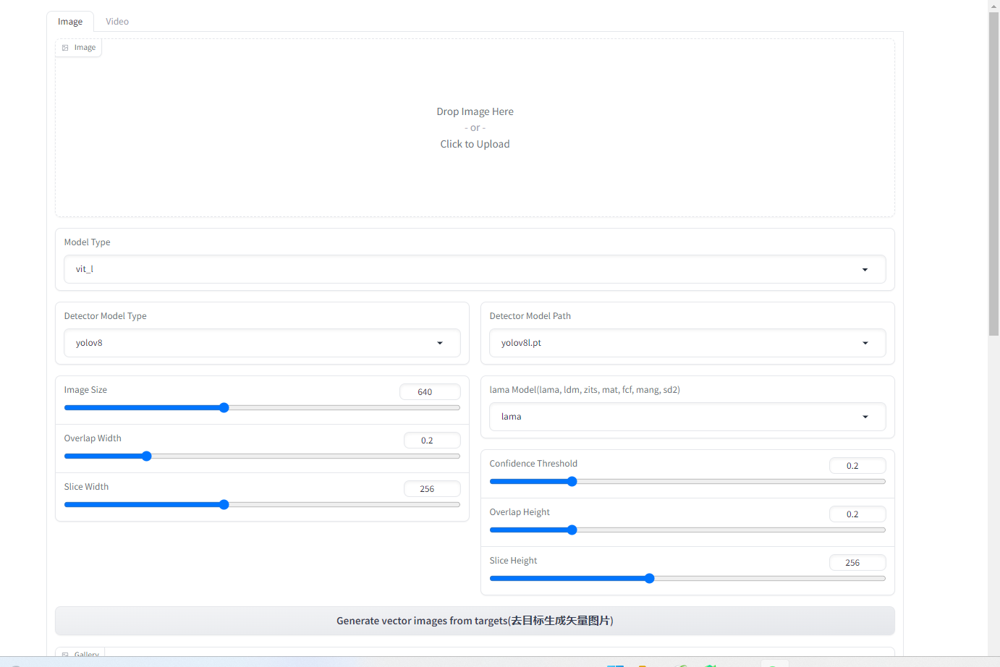
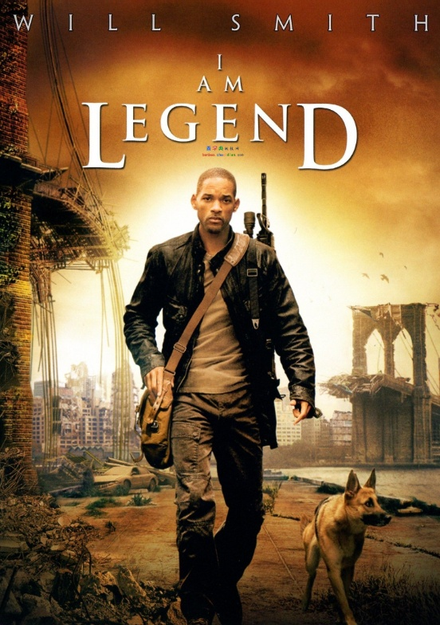
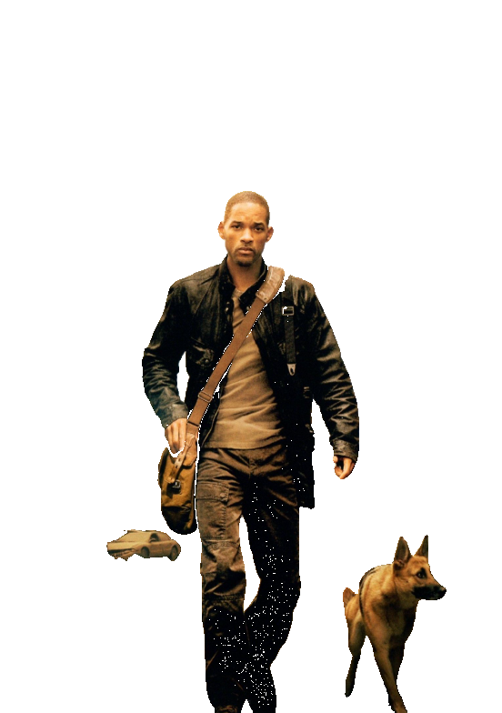
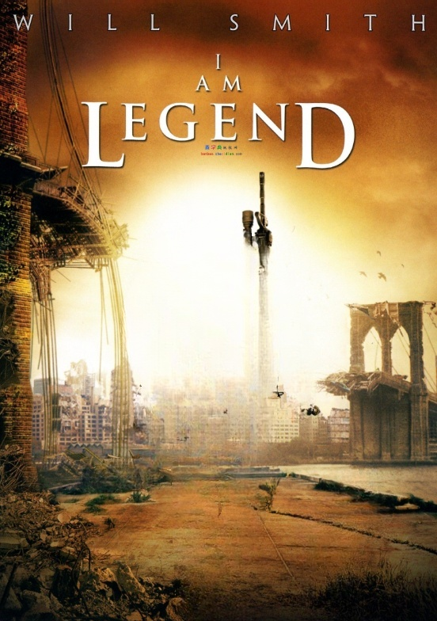
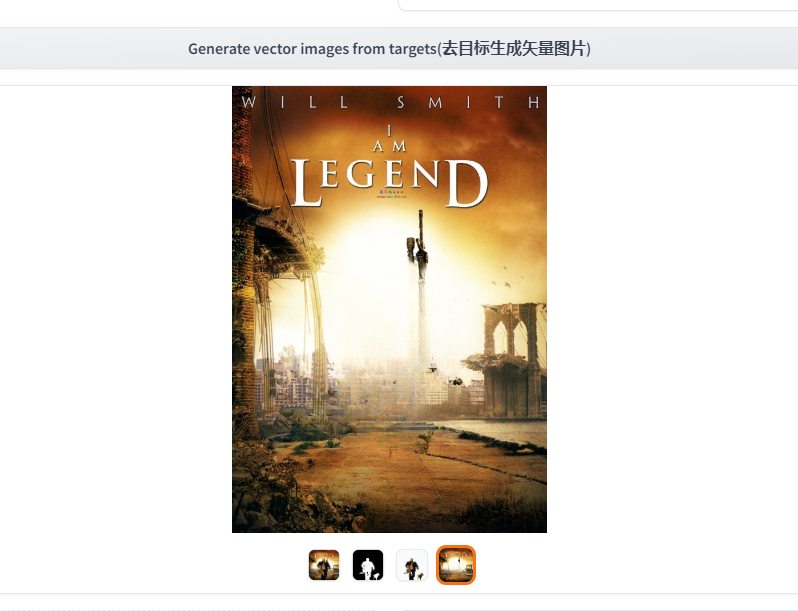
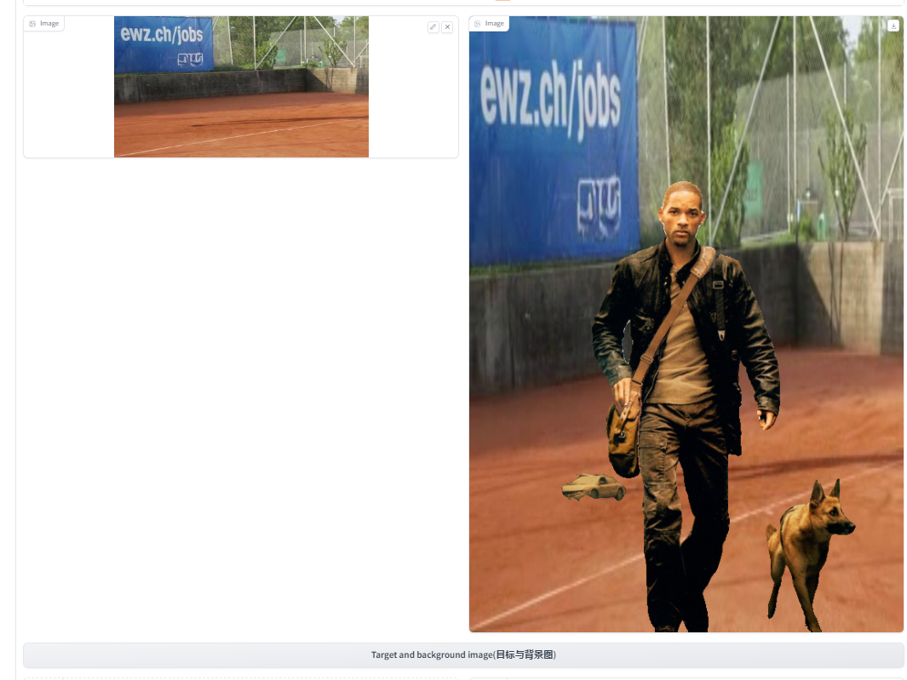
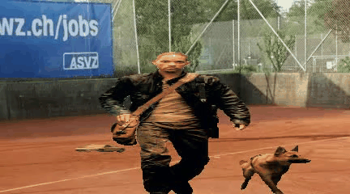
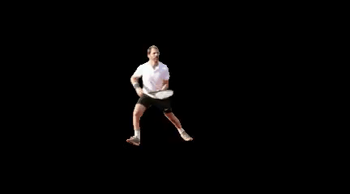
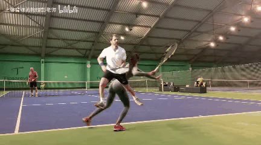

English | [简体中文](README_cn.md)
# Modify-Anything: Segment Anything Meets Video and Image Modify and Picture Video Background Replacement

Modify-Anything is based on YOLO5,YOLO8, for video and image detection. Segment-anything,lama_cleaner is applied to 
segment, modify, erase, and obtain the target image. The background of the target image video
can be changed, and the background of the image video can be changed.


## <span>Installation</span>
The code requires python>=3.8, as well as pytorch>=1.7 and torchvision>=0.8. Please follow the instructions here
to install both PyTorch and TorchVision dependencies. Installing both PyTorch and TorchVision with CUDA support 
is strongly recommended.
To install the Modify-Anything, please follow these steps:
-  The first time it runs, it will download the model itself. If the download is too slow, the phone will download and place it as follows
-  Train your own YOLO5 or YOLOv8 models to detect segmentation, modification, and erasure.
   The default models used in this project are "YOLOv5l. pt", "YOLOv5l6. pt", "YOLOv8l. pt", and "YOLOv8x. pt".
   Please download and place them in the project root directory
-  Download the Segment anything model and place it in the project root directory sam_vit_h_4b8939.pth (change to) vit_h.pth,sam_vit_l_0b3195.pth (change to) vit_l.pth,sam_vit_b_01ec64.pth (change to) vit_b.pth
-  Install pip install ultralytics sahi fal_serverless lama_cleaner tqdm or pip install - r requirements. Txt
-  Run python app.py 
-  The generated results are all in the output directory

<p align="center">
    
</p>

## <span>Modify Anything Image and Picture Video Background Replacement</span>

<table>
    <tr>
      <td></td>
      <td></td>
      <td></td>
    </tr>
</table>
<table>
    <tr>
      <td></td>
      <td></td>
      <td></td>
    </tr>
</table>

## <span>Modify Anything Video and Picture Video Background Replacement</span>
<table>
    <tr>
      <td></td>
      <td></td>
      <td></td>
    </tr>
</table>
<table>
    <tr>
      <td></td>
      <td></td>
    </tr>
</table>

## Acknowledgments
- [LaMa](https://github.com/advimman/lama)
- [Segment Anything](https://github.com/facebookresearch/segment-anything)
- [YOLOv8](https://github.com/ultralytics/ultralytics)

## Citation
If you find this work useful for your research, please cite us:
```
@article{
  title={Modify-Anything: Segment Anything Meets Video and Image Modify and Picture Video Background Replacement},
  author={Zhang Jing},
  year={2023}
}
```
