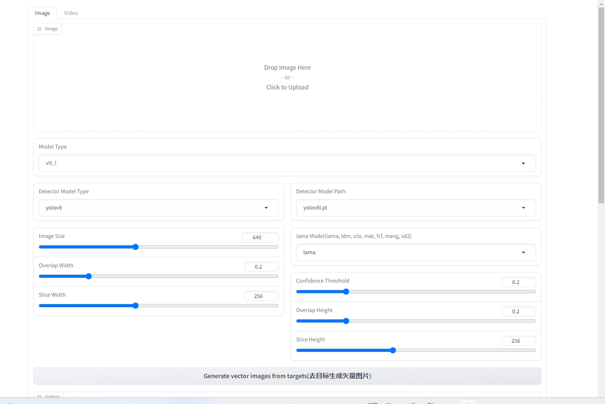
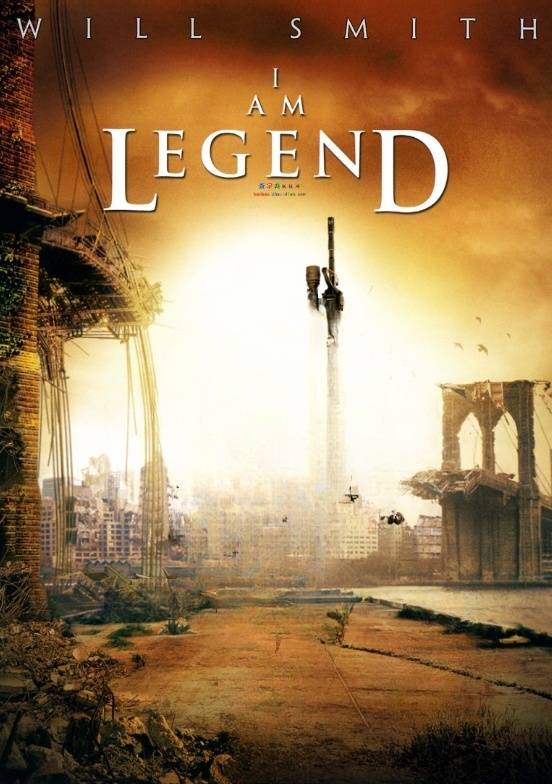
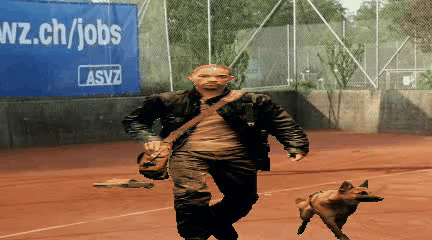
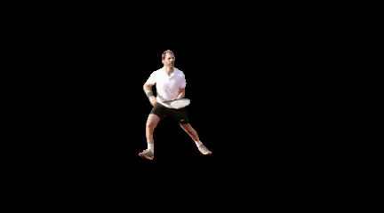

简体中文 | [English](README.md)
# Modify-Anything: Segment Anything Meets Video and Image Modify and Picture Video Background Replacement

Modify-Anything 是基于YOLO5,YOLO8对视频，图片检测指定目标进行应用segment-anything,lama_cleaner对目标
分割，修改，擦除，得到目标对目标图片视频进行换背景等，可换图背景视频背景。

## <span>安装</span>
该代码需要python>=3.8，以及pytorch>=1.7和torchvision>=0.8。请按照此处的说明安装PyTorch和TorchVision依赖项。
强烈建议在支持CUDA的情况下同时安装PyTorch和TorchVision。

要安装Modify Anything，请执行以下步骤：
- 第一次运行都会自己下载模型,如下载过慢手机下载放置如下
- 训练自己的要检测分割，修改，擦除的yolo5或者yolov8模型,本项目用的默认"yolov5l.pt", "yolov5l6.pt", "yolov8l.pt", "yolov8x.pt"模型请自己下载放入项目根目录中
- 下载Segment-anything模型放入项目根目录中,sam_vit_h_4b8939.pth 改为vit_h.pth,sam_vit_l_0b3195.pth改为vit_l.pth,sam_vit_b_01ec64.pth改为vit_b.pth
- 安装pip install ultralytics  sahi  fal_serverless  lama_cleaner  tqdm  或者pip install -r requirements.txt
- 运行python app.py 
- 生成结果全在output目录

<p align="center">
    
</p>

## <span>Modify Anything Image and Picture Video Background Replacement</span>

<table>
    <tr>
      <td></td>
      <td></td>
      <td></td>
    </tr>
</table>
<table>
    <tr>
      <td></td>
      <td></td>
      <td></td>
    </tr>
</table>

## <span>Modify Anything Video and Picture Video Background Replacement</span>
<table>
    <tr>
      <td></td>
      <td></td>
      <td></td>
    </tr>
</table>
<table>
    <tr>
      <td></td>
      <td></td>
    </tr>
</table>

## Acknowledgments
- [LaMa](https://github.com/advimman/lama)
- [Segment Anything](https://github.com/facebookresearch/segment-anything)
- [YOLOv8](https://github.com/ultralytics/ultralytics)

## Citation
If you find this work useful for your research, please cite us:
```
@article{
  title={Modify-Anything: Segment Anything Meets Video and Image Modify and Picture Video Background Replacement},
  author={Zhang Jing},
  year={2023}
}
```